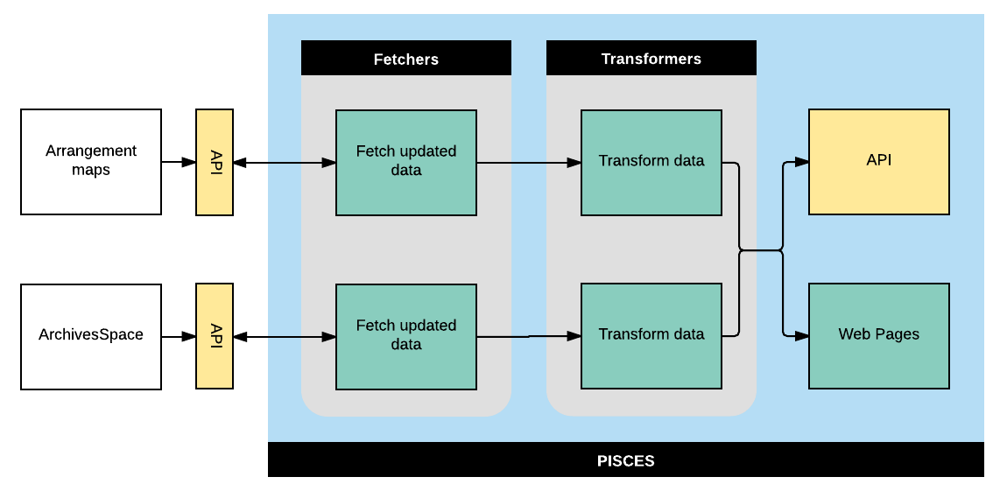

# pisces
A service for fetching, merging and transforming data for discovery.

pisces is part of [Project Electron](https://github.com/RockefellerArchiveCenter/project_electron), an initiative to build sustainable, open and user-centered infrastructure for the archival management of digital records at the [Rockefeller Archive Center](http://rockarch.org/).

[](https://travis-ci.org/RockefellerArchiveCenter/pisces)

## Setup

Install [git](https://git-scm.com/) and clone the repository

    $ git clone https://github.com/RockefellerArchiveCenter/pisces.git

Install [Docker](https://store.docker.com/search?type=edition&offering=community) and run docker-compose from the root directory

    $ cd pisces
    $ docker-compose up

Once the application starts successfully, you should be able to access the application in your browser at `http://localhost:8007`

When you're done, shut down docker-compose

    $ docker-compose down

Or, if you want to remove all data

    $ docker-compose down -v


## Developing
Git pre-commit hooks can be enabled in this repository by running:
```
$ pip install pre-commit
$ pre-commit install
```

## Services

pisces has three main sets of services, all of which are exposed via HTTP endpoints (see [Routes](#routes) section below):

* Fetch data from data sources
* Merge data from different sources into a unified SourceData object
* Transform source data into target data




### Routes

| Method | URL | Parameters | Response  | Behavior  |
|--------|-----|---|---|---|
|GET, PUT, POST, DELETE|/fetches/||200|Returns data about FetchRun routines|
|POST|/fetch/archivesspace/updates|`object_type` (required) - target object type, one of `resources`, `objects`, `subjects`, `agents`|200|Fetches updated data from ArchivesSpace|
|POST|/fetch/archivesspace/deletes|`object_type` (required) - target object type, one of `resources`, `objects`, `subjects`, `agents`|200|Fetches deleted data from ArchivesSpace|
|POST|/fetch/cartographer/updates|`object_type` (required) - target object type, one of `arrangement_map`|200|Fetches updated data from Cartographer|
|POST|/fetch/cartographer/deletes|`object_type` (required) - target object type, one of `arrangement_map`|200|Fetches deleted data from Cartographer|
|POST|/transform/||200|Transforms data|
|POST|/merge/||200|Merges data|
|GET|/status||200|Return the status of the service|
|GET|/schema.json||200|Returns the OpenAPI schema for this service|

## License

This code is released under an [MIT License](LICENSE).
